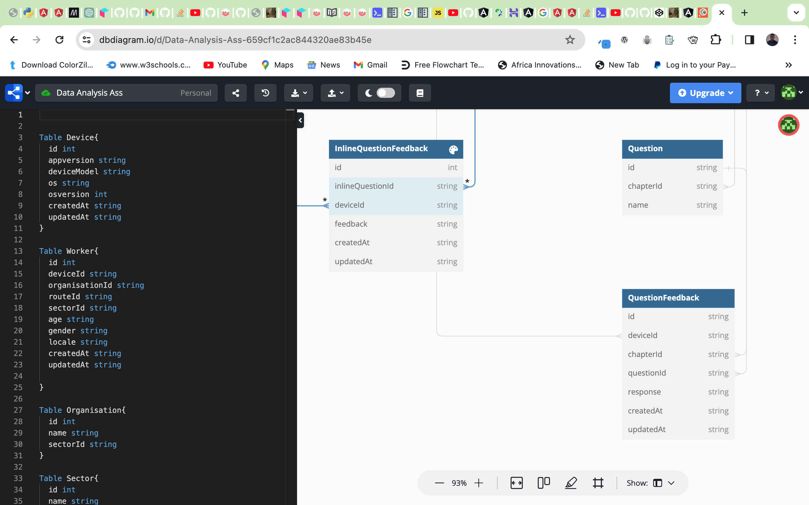
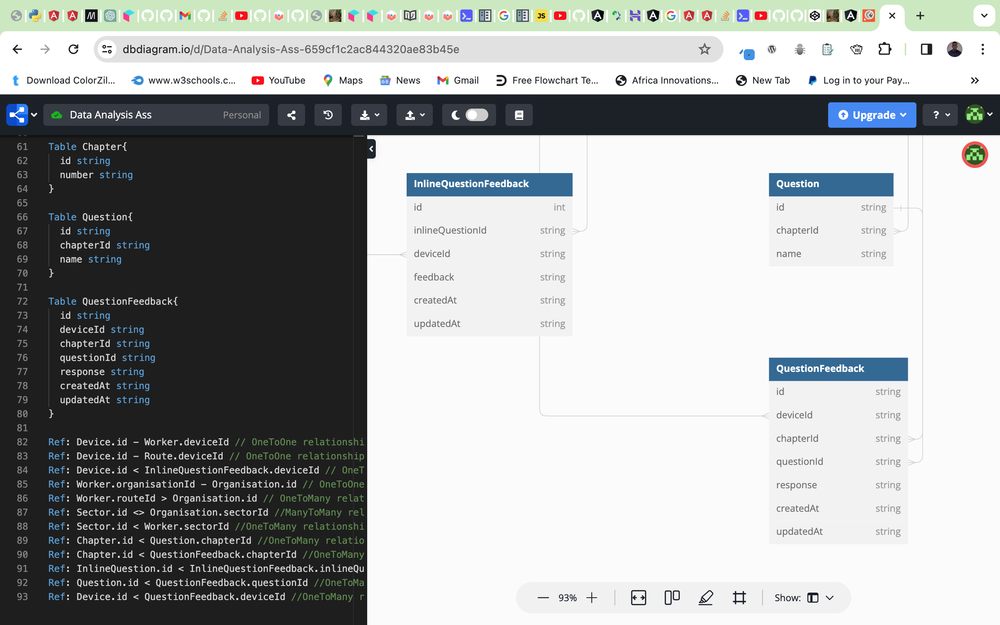
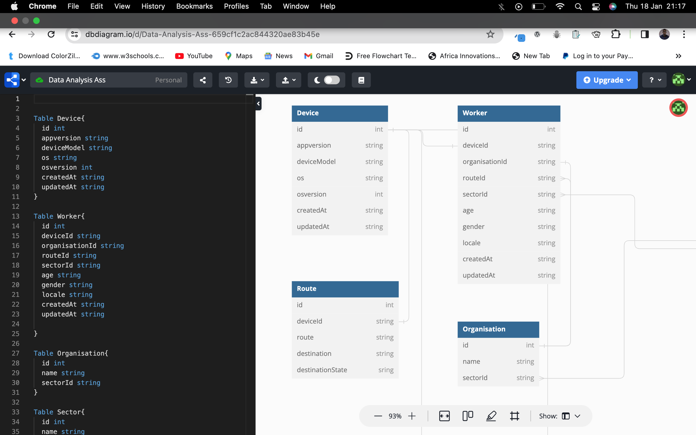
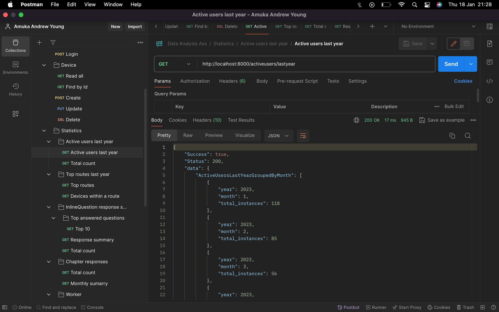
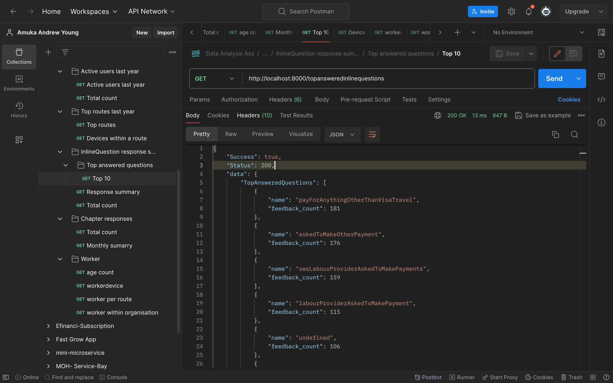
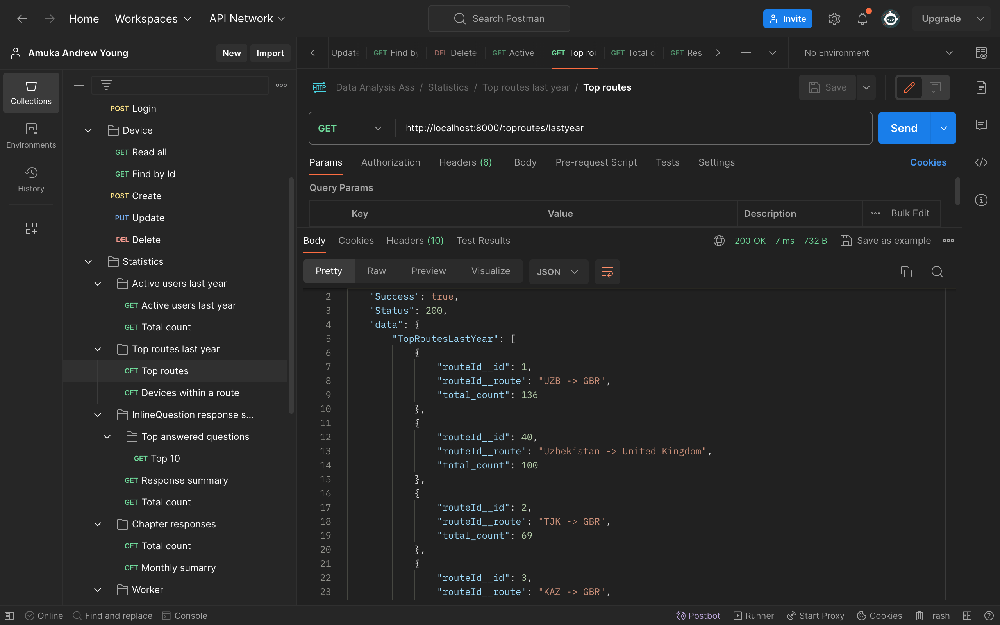
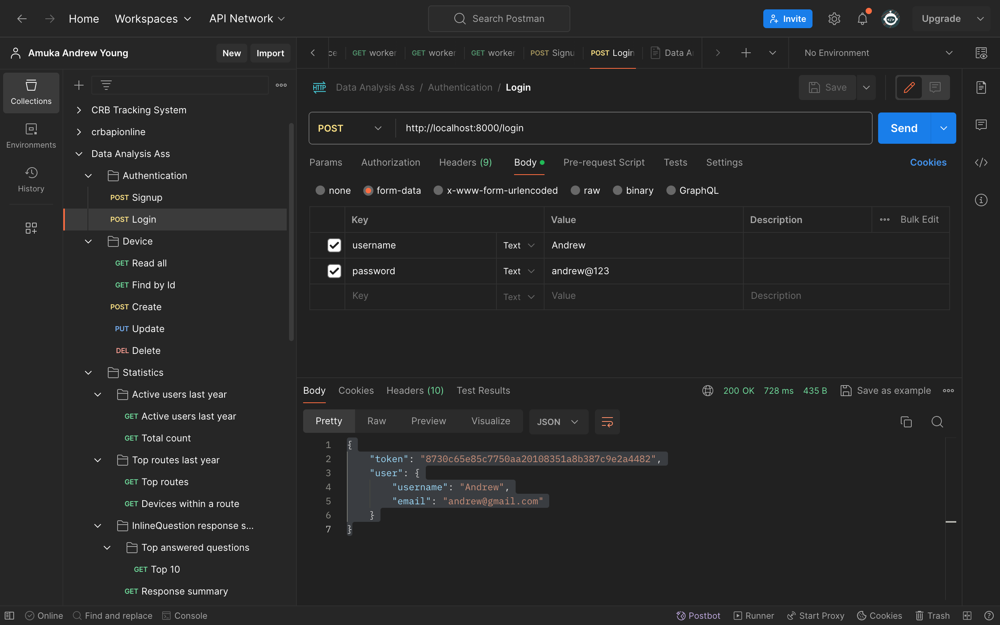

# Data-Analysis-Ass

## Task

This is a backend application design in Python/Django. The application includes scripts for extracting raw disorganize data from a JSON file and populating it to the database. This data was then visualized data in a frontend Angular application url:https://github.com/Amukayoung/Data-Analysis-Frontend

## Technology

- Python/Django
- Django Rest Framework(DRF)

## Database

The database used is SQLite. find attached the database structure url:https://dbdiagram.io/d/Data-Analysis-Ass-659cf1c2ac844320ae83b45e

## API Documentation

Find attached at API postman Doc URL: https://documenter.getpostman.com/view/21029286/2s9YsRdVKK

Some of the screenshots for the Postman API test

## Getting Started

These instructions will guide you on how to set up and run the project on your local machine.

## Prerequisites

Before you begin, ensure you have the following installed:

Python (version x.x.x)
pip

## Installing Dependencies

Navigate to the project root and install the required dependencies:

pip install -r requirements.txt

## Database Setup

Apply migrations to set up the database:

python manage.py migrate
Running the Application
Start the Django development server:

python manage.py runserver
Visit http://127.0.0.1:8000/ in your web browser to view the application.
Enjoy the Apis...

